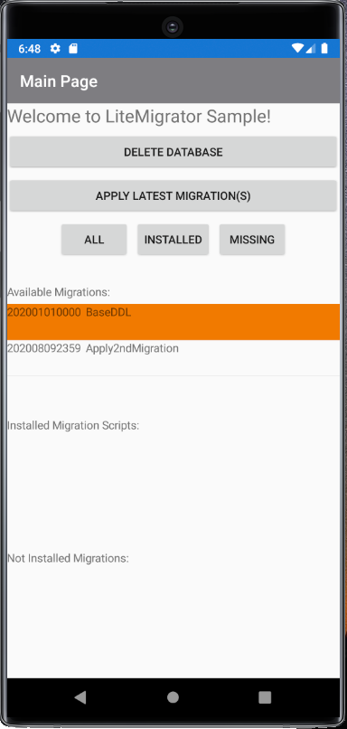
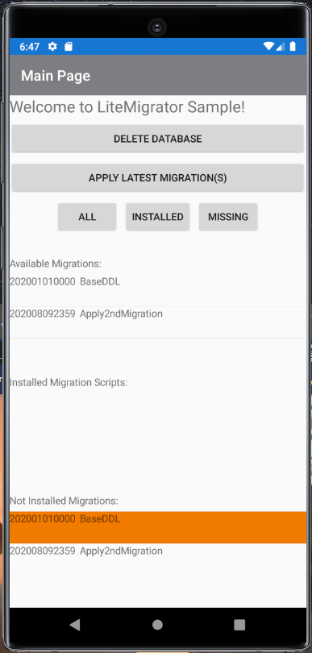
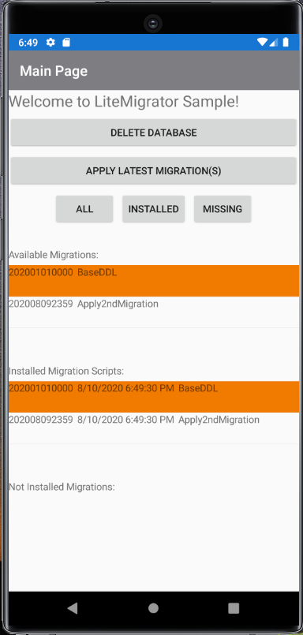

# LiteMigrator Sample Project

[]()

[LiteMigrator](https://github.com/xenoinc/LiteMigrator) is a tiny cross-platform SQLite migration framework for .NET cross-platform applications using (_.NET Standard_). This library was built for use with .NET MAUI 🐒, Avalonia, and Uno projects. So it needs to be quick, simple and reliable when managing databases.

[LiteMigrator](https://github.com/xenoinc/LiteMigrator) takes a "migrate-up" approach. In most applications, we only move forward and rarely downgrade. This helps keep the library small and nimble.

Download Package: [](https://www.nuget.org/packages/LiteMigrator/)

Sponsored by [Xeno Innovations](https://xenoinc.com) and [Suess Labs](https://suesslabs.com), this project was made with nerd-love.

  


## Use it in your project

Get [LiteMigrator](https://www.nuget.org/packages/LiteMigrator) on NuGet today!

### Building the Sample

1. `git submodule update --init --recursive`
2. Run the `LiteMigrator.MauiSample` on your favorite platform!
   * Windows, Android, iOS, or Mac!

## Getting Started

Detailed instructions can be found on the [Using LiteMigrator](https://github.com/xenoinc/LiteMigrator/wiki/Using-LiteMigrator) wiki page.

1. Add **LiteMigrator** project to your solution
2. Create a folder in your solution to hold the scripts
3. Add SQL files as **Embedded Resources**
  * You must use the naming convention, "_YYYYMMDDhhmm-FileName.sql_"
4. Wire-up the controller

### Use Case 1

```cs
  var scriptNamespace = "MyProject.Namespace.Scripts";

  using (var migrator = new LiteMigration(
    "c:\\path\\to\\sqlite.db3"
    Assembly.GetExecutingAssembly(),
    scriptNamespace))
  {
    bool isSuccessful = await migrator.MigrateUpAsync();
  }
```

### Use Case 2 - Class Constructor

```cs
public async Task InstallMigrationsAsync()
{
  // Your EXE/DLL with the scripts
  var resourceAssm = Assembly.GetExecutingAssembly();
  var dbPath = @"C:\TEMP\MyDatabase.db3";
  var migsNamespace = "MyProjNamespace.Scripts";

  var liteMig = new LiteMigration(dbPath, resourceAssm, migsNamespace);
  bool = success = await liteMig.MigrateUpAsync();

  // Required after v0.6
  liteMig.Dispose();
}
```

## How to Contribute

Give it a test drive and support making LiteMigrator better :)

1. Fork on GitHub
2. Create a branch
3. Code (_and add tests)
4. Create a Pull Request (_PR_) on GitHub
   1. Target the ``develop`` branch and we'll get it merged up to ``master``
   2. Target the ``master`` branch for hotfixes
5. Get the PR merged
6. Welcome to our contributors' list!

## Known Limitations
Please visit the [Known Limitations](https://github.com/xenoinc/SQLiteMigrator/wiki/Known-Limitations) wiki page
